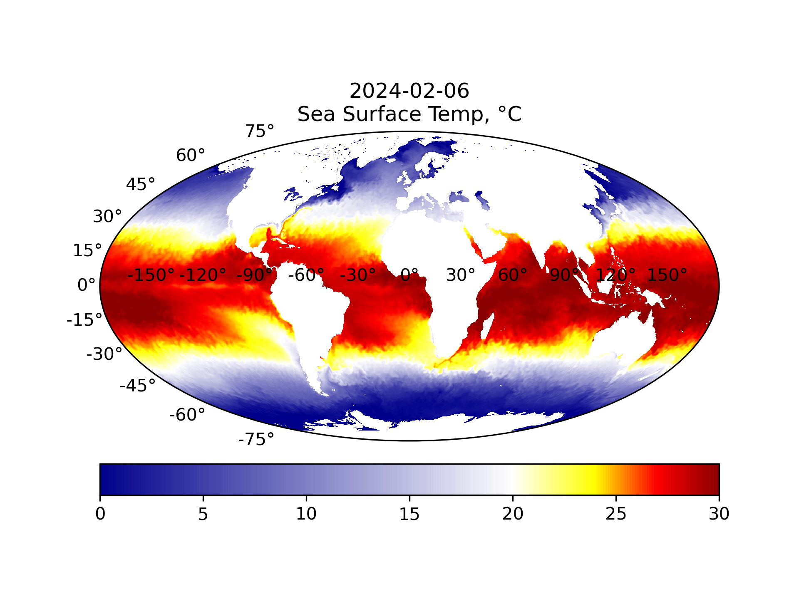
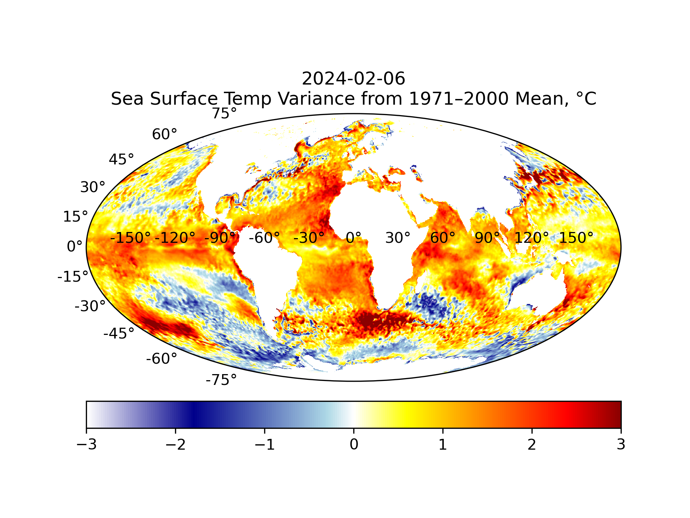
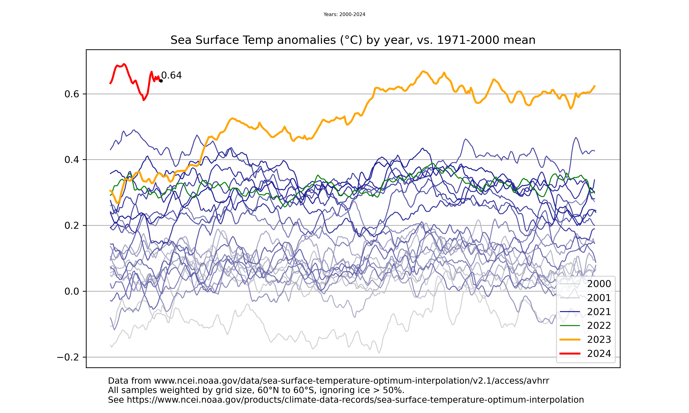

# Sea Surface Temp Visualization

This python code downloads daily worldwide sea surface temp datasets
and visualizes them either as a world map on a given day, or as a time
series per year.

Latest files, auto-produced daily by a github action:

Examples:

